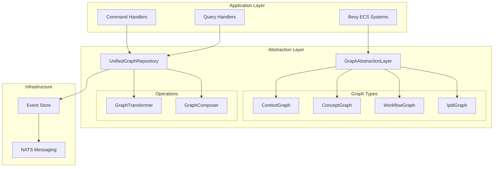

# Graph Abstraction Layer Architecture

## Overview

The Graph Abstraction Layer provides a unified interface for working with different types of graphs in the CIM (Composable Information Machine) system. It enables seamless transformation and composition of graphs while maintaining type safety and preserving domain-specific semantics.

## Architecture Diagram



## Core Components

### 1. Graph Types

The abstraction layer supports four primary graph types, each optimized for specific use cases:

#### ContextGraph
- **Purpose**: General-purpose graphs for modeling relationships and contexts
- **Features**: 
  - Flexible node and edge types
  - Rich metadata support
  - Spatial positioning
- **Use Cases**: Knowledge graphs, entity relationships, system architectures

#### ConceptGraph
- **Purpose**: Semantic graphs for conceptual modeling
- **Features**:
  - Concept similarity calculations
  - Semantic relationships
  - Conceptual distance metrics
- **Use Cases**: Ontologies, taxonomies, semantic networks

#### WorkflowGraph
- **Purpose**: Process and workflow modeling
- **Features**:
  - Step sequencing
  - Dependency tracking
  - Execution state management
- **Use Cases**: Business processes, data pipelines, task orchestration

#### IpldGraph
- **Purpose**: Content-addressed graphs using IPLD
- **Features**:
  - Content integrity via CIDs
  - Immutable references
  - Distributed storage support
- **Use Cases**: Blockchain data, verifiable data structures, distributed systems

### 2. Core Interfaces

#### GraphImplementation Trait
```rust
pub trait GraphImplementation: Clone + Send + Sync {
    fn graph_id(&self) -> GraphId;
    fn graph_type(&self) -> &str;
    
    // Node operations
    fn add_node(&mut self, id: NodeId, data: NodeData) -> Result<(), GraphOperationError>;
    fn get_node(&self, id: NodeId) -> Option<NodeData>;
    fn remove_node(&mut self, id: NodeId) -> Result<(), GraphOperationError>;
    fn list_nodes(&self) -> Vec<NodeId>;
    
    // Edge operations
    fn add_edge(&mut self, id: EdgeId, source: NodeId, target: NodeId, data: EdgeData) 
        -> Result<(), GraphOperationError>;
    fn get_edge(&self, id: EdgeId) -> Option<(NodeId, NodeId, EdgeData)>;
    fn remove_edge(&mut self, id: EdgeId) -> Result<(), GraphOperationError>;
    fn list_edges(&self) -> Vec<EdgeId>;
    
    // Metadata operations
    fn get_metadata(&self) -> &GraphMetadata;
    fn update_metadata(&mut self, metadata: GraphMetadata);
    
    // Query operations
    fn find_nodes_by_type(&self, node_type: &str) -> Vec<NodeId>;
    fn get_node_edges(&self, node_id: NodeId) -> Vec<EdgeId>;
    fn find_path(&self, from: NodeId, to: NodeId) -> Option<Vec<NodeId>>;
}
```

### 3. Transformation System

The transformation system enables converting between different graph types while preserving as much information as possible:

#### GraphTransformer Trait
```rust
pub trait GraphTransformer: Send + Sync {
    fn transform(
        &self,
        source: &GraphType,
        target_type: &str,
        options: TransformationOptions,
    ) -> Result<GraphType, TransformationError>;
    
    fn can_transform(&self, source_type: &str, target_type: &str) -> bool;
}
```

#### Transformation Rules
- **Context → Concept**: Nodes become concepts, edges become relationships
- **Concept → Workflow**: Concepts become steps, relationships become dependencies
- **Workflow → Context**: Steps become nodes, dependencies become edges
- **Any → IPLD**: All data is content-addressed

### 4. Composition System

The composition system allows combining multiple graphs into a unified graph:

#### GraphComposer Trait
```rust
pub trait GraphComposer: Send + Sync {
    fn compose(
        &self,
        graphs: &[&GraphType],
        target_type: &str,
        options: CompositionOptions,
    ) -> Result<GraphType, CompositionError>;
    
    fn preview_conflicts(
        &self,
        graphs: &[&GraphType],
    ) -> Vec<(String, ConflictType)>;
}
```

#### Conflict Resolution Strategies
- **KeepFirst**: Keep data from the first graph
- **KeepLast**: Keep data from the last graph
- **Merge**: Intelligently merge metadata
- **Fail**: Fail on any conflict

## Integration with Bevy ECS

### GraphAbstractionPlugin
The plugin integrates the abstraction layer with Bevy's ECS:

```rust
pub struct GraphAbstractionPlugin {
    pub command_handler: Arc<UnifiedGraphCommandHandler>,
    pub query_handler: Arc<AbstractGraphQueryHandler>,
}
```

### Integrated Systems
1. **integrated_create_graph_system**: Syncs graph creation with abstract representation
2. **integrated_node_system**: Syncs node operations
3. **integrated_edge_system**: Syncs edge operations

## Data Flow

### Command Flow
1. User action in Bevy UI
2. Command sent to ECS system
3. System updates ECS components
4. Integration system updates abstract graph
5. Changes persisted to event store

### Query Flow
1. Query request from application
2. AbstractGraphQueryHandler processes request
3. Retrieves data from appropriate graph adapter
4. Returns unified result

## Best Practices

### 1. Graph Type Selection
- Use **ContextGraph** for general relationships
- Use **ConceptGraph** for semantic modeling
- Use **WorkflowGraph** for process automation
- Use **IpldGraph** for verifiable data

### 2. Transformation Guidelines
- Always specify transformation options
- Handle data loss warnings appropriately
- Test round-trip transformations
- Document custom type mappings

### 3. Composition Patterns
- Define clear conflict resolution strategies
- Use ID prefixes to avoid conflicts
- Validate edge references after composition
- Test with representative data sets

### 4. Performance Considerations
- Cache frequently accessed graphs
- Use batch operations when possible
- Implement lazy loading for large graphs
- Monitor memory usage with many graphs

## Migration Guide

### From Direct Graph Usage
```rust
// Before: Direct graph manipulation
let mut graph = Graph::new();
graph.add_node(node_id, node_data);

// After: Using abstraction layer
let graph = abstraction.get_or_create_graph(
    graph_id,
    GraphType::Context,
    "My Graph"
).await?;
graph.add_node(node_id, NodeData { ... })?;
```

### Adding Custom Graph Types
1. Implement the `GraphImplementation` trait
2. Create an adapter implementing `GraphAdapter`
3. Register with the `GraphType` enum
4. Update transformation rules

## Error Handling

### Common Errors
- **NodeNotFound**: Referenced node doesn't exist
- **EdgeValidationFailed**: Edge references invalid nodes
- **TransformationNotSupported**: No transformation path exists
- **ConflictDetected**: Composition conflict without resolution

### Error Recovery
- Use transactions for multi-step operations
- Implement retry logic for transient failures
- Log detailed error context
- Provide user-friendly error messages

## Future Enhancements

### Planned Features
1. **Graph Versioning**: Track graph evolution over time
2. **Distributed Graphs**: Support for federated graph data
3. **Real-time Sync**: Live updates across graph instances
4. **Advanced Queries**: GraphQL-like query language
5. **Performance Optimizations**: Indexed lookups, caching

### Extension Points
- Custom graph types via traits
- Pluggable transformation strategies
- External storage backends
- Custom conflict resolution logic 